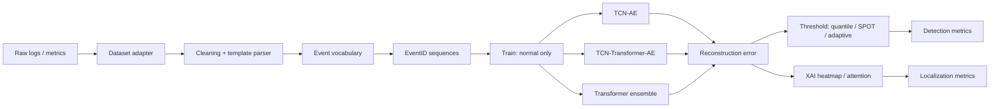
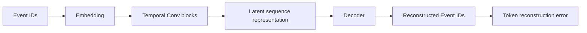
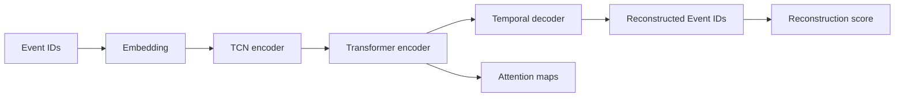
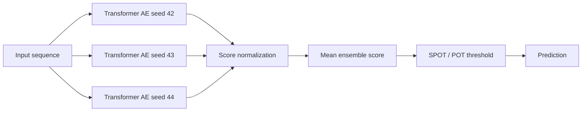
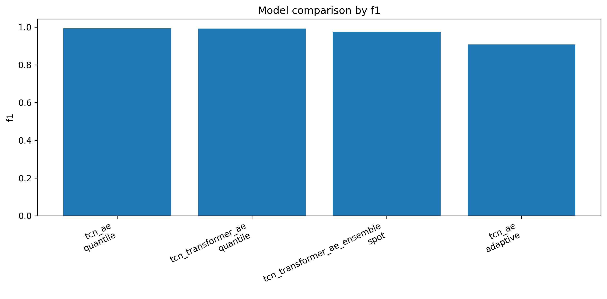
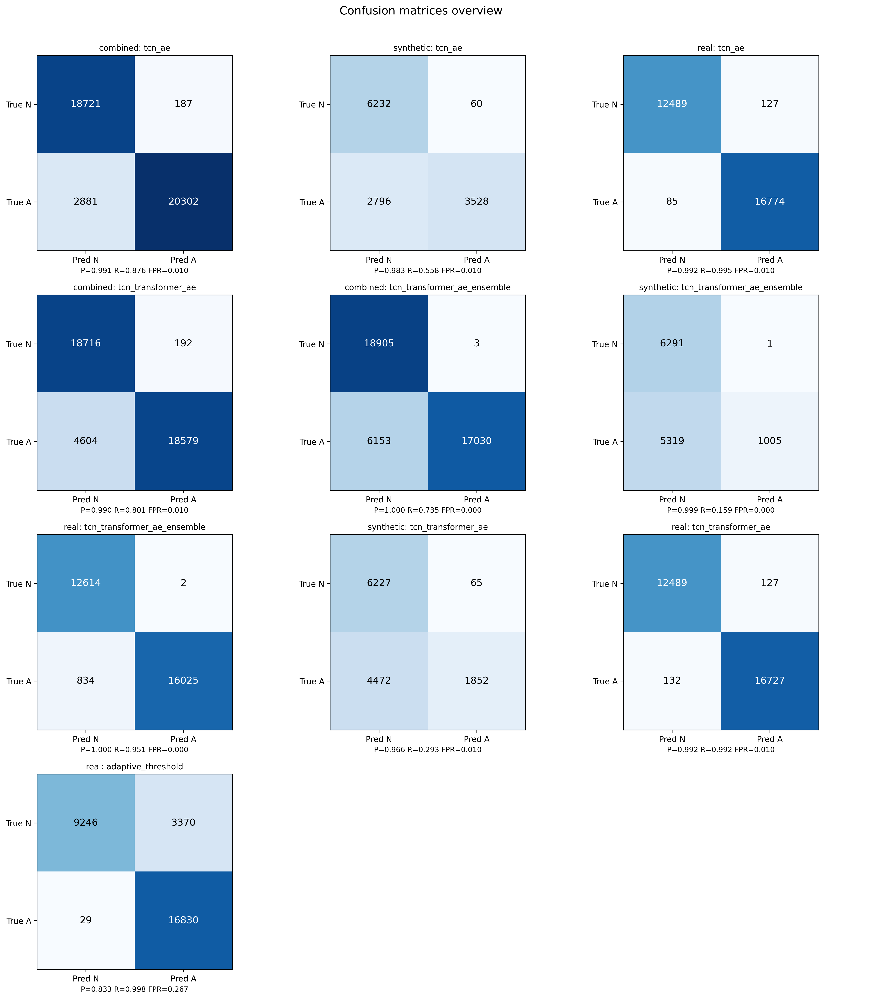
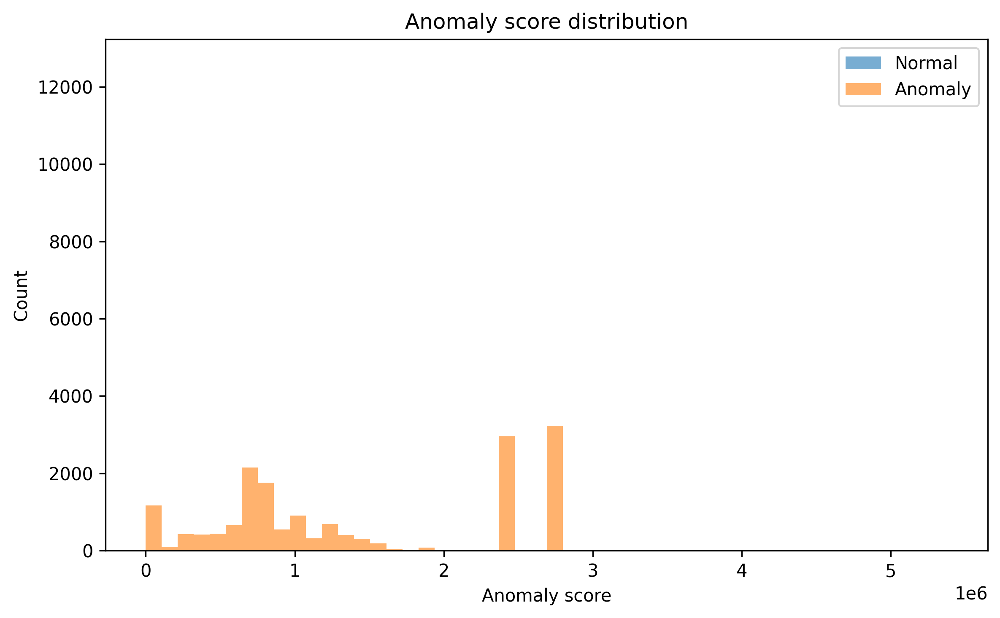
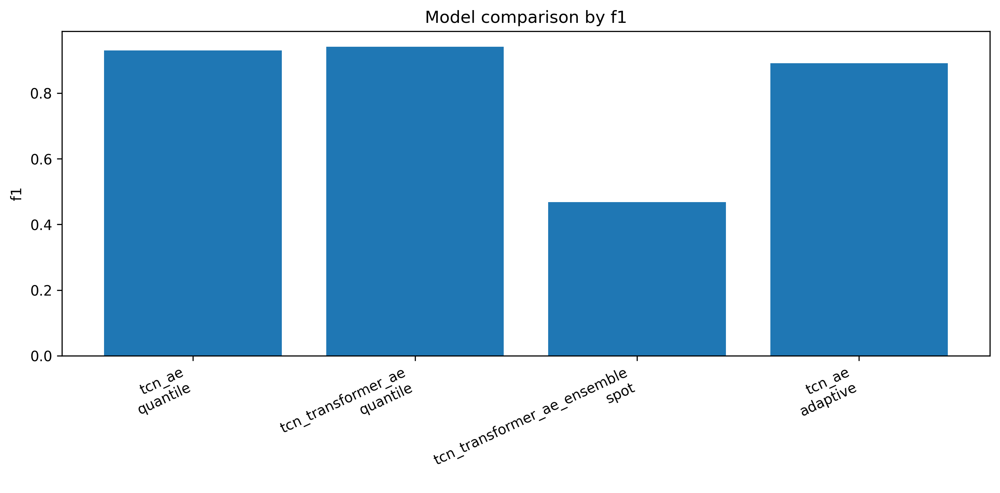
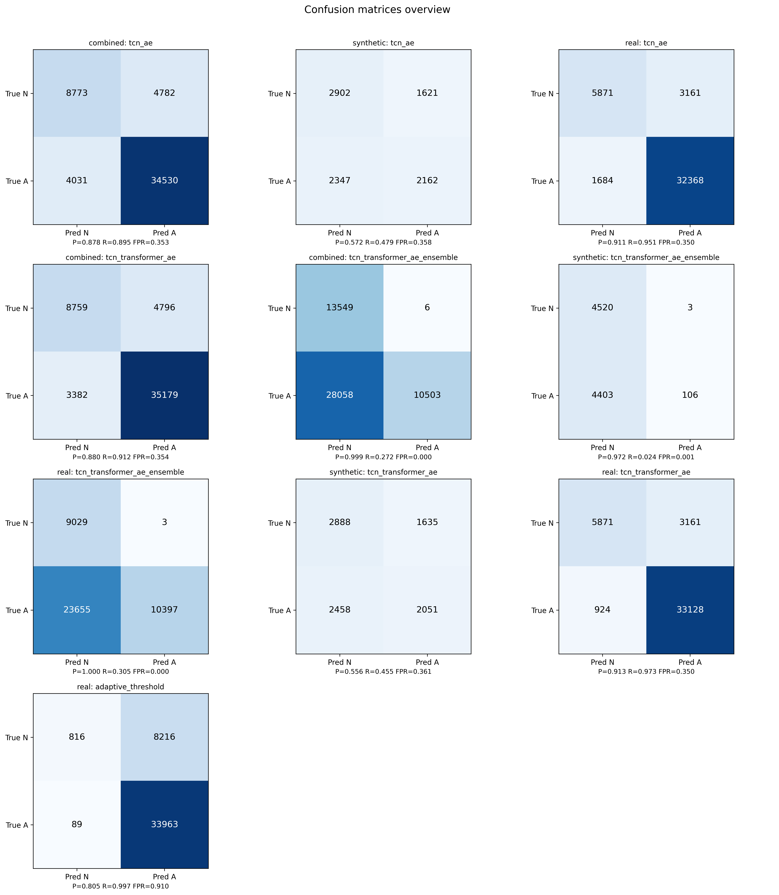
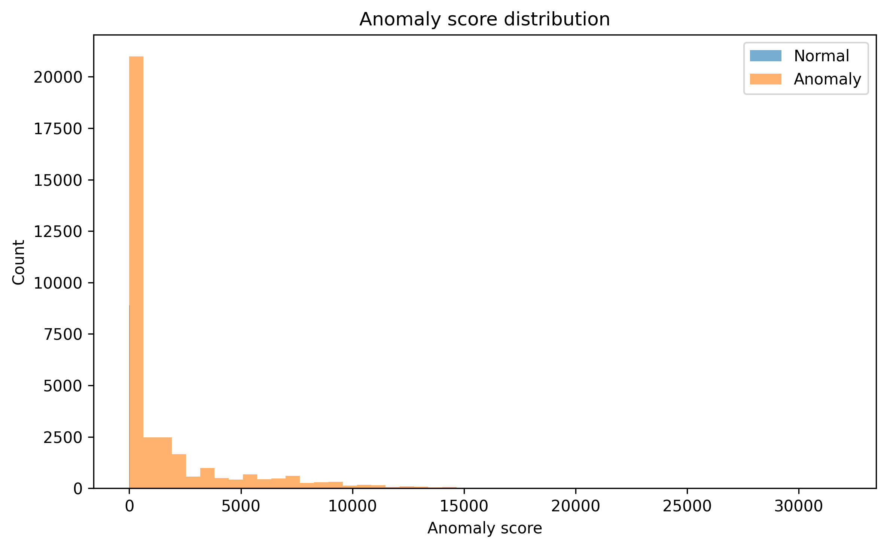

# TCN / TCN-Transformer Autoencoder для обнаружения аномалий в логах

Проект реализует полный экспериментальный pipeline для обнаружения, оценки и частичной локализации аномалий в логах и метриках микросервисных/инфраструктурных систем.

Основная идея: обучать автоэнкодер только на нормальных последовательностях событий, а затем считать ошибку реконструкции. Чем хуже модель восстанавливает последовательность, тем выше anomaly score.

Проект поддерживает несколько вариантов модели:

- `tcn_ae` - базовый TCN Autoencoder.
- `tcn_transformer_ae` - TCN Autoencoder с Transformer attention-блоком.
- `tcn_transformer_ae_ensemble` - ансамбль нескольких TCN-Transformer AE с разными seed.
- `adaptive_threshold` - отдельная пороговая стратегия поверх anomaly score.

## Краткий Итог

На текущих экспериментах reconstruction-подход работает хорошо, если правильно собрать объект наблюдения:

- для LO2 объектом является сценарий/сессия сервиса;
- для Loghub/HDFS объектом должен быть цельный `BlockId`, а не первые N строк лога;
- для RCAEval числовые метрики превращаются в sparse pseudo-log события, чтобы автоэнкодер решал именно задачу реконструкции.

Текущие лучшие результаты:

| Dataset | Лучший метод | Precision | Recall | F1 | FP | FN | Комментарий |
|---|---:|---:|---:|---:|---:|---:|---|
| LO2 | `tcn_ae + quantile` | 0.999 | 0.985 | 0.992 | 9 | 138 | Сильный результат, но датасет сильно перекошен в сторону аномалий |
| Loghub2 observation v2 | `tcn_ae + quantile` | 0.992 | 0.995 | 0.994 | 127 | 85 | Лучший и наиболее стабильный результат |
| RCAEval reconstruction v3 | `tcn_transformer_ae + quantile` | 0.913 | 0.973 | 0.942 | 3161 | 924 | После настройки порога F1 поднялся выше 0.94 |

Если смотреть на среднюю устойчивость по всем трём датасетам, лучший основной кандидат сейчас - `tcn_ae`: он чуть стабильнее, проще и не требует ансамбля. Если смотреть только RCAEval, там выигрывает `tcn_transformer_ae`.

## Архитектура Pipeline



## Архитектура Моделей

### TCN Autoencoder



`tcn_ae` является главным baseline. Он быстрый, устойчивый и в текущих результатах выигрывает на LO2 и Loghub2.

### TCN-Transformer Autoencoder



`tcn_transformer_ae` добавляет attention-механизм. Он полезен для анализа последовательных зависимостей и сейчас даёт лучший F1 на RCAEval.

### Ensemble + SPOT



Ансамбль нужен для проверки устойчивости результата. На текущих данных он не всегда выигрывает по F1: например, на RCAEval ensemble + SPOT слишком консервативен и ловит мало аномалий.

## Датасеты

| Dataset | Raw path | Active config | Output path | Статус |
|---|---|---|---|---|
| LO2 | `data/raw/lo2` | `configs/experiment_lo2.yaml` | `outputs/lo2` | Исторический сильный baseline, сейчас исключён из активной тетрадки |
| Loghub2 / HDFS | `data/raw/loghub2` | `configs/experiment_loghub_observation_v2.yaml` | `outputs/loghub2_observation_v2` | Активный улучшенный вариант |
| RCAEval | `data/raw/rcaeval` | `configs/experiment_rcaeval_reconstruction_v3.yaml` | `outputs/rcaeval_reconstruction_v3` | Активный reconstruction-friendly вариант |

### LO2

LO2 хорошо подходит для демонстрации reconstruction-подхода, но распределение классов там необычное: аномальных сессий намного больше, чем нормальных. Поэтому LO2 полезен как отдельный тест, но не должен быть единственной опорой для выводов.

### Loghub2 Observation v2

Первичный Loghub/HDFS нельзя нормально решать через первые N строк общего потока. Для HDFS естественный объект наблюдения - `BlockId`.

В `loghub2_observation_v2` используется:

- официальный `EventId` из `HDFS_full.log_structured.csv`;
- цельные `BlockId`-сессии;
- block-level признаки:
  - длина блока;
  - первое и последнее событие;
  - гистограмма событий;
  - пары переходов;
  - редкие переходы;
- бюджет данных через цельные блоки:

```yaml
loghub_row_budget: 600000
loghub_block_complete_budget: true
loghub_budget_balance_labels: true
loghub_budget_anomaly_fraction: 0.5
```

Это означает: берём около 600k строк, но не разрезаем блоки пополам.

### RCAEval Reconstruction v3

RCAEval содержит числовые метрики. Чтобы не уходить в отдельный metric-baseline, метрики переводятся в pseudo-log события:

- `row_severity_*`
- `row_abnormal_count_*`
- `row_dominant_type_*`
- `row_dominant_trend_*`
- `window_max_severity_*`
- `window_abnormal_rows_*`
- metric-level tokens с типом, направлением и трендом.

Так автоэнкодер остаётся автоэнкодером: он реконструирует последовательности дискретных событий, а не запускает отдельный числовой детектор.

## Активная Тетрадка

Основной notebook:

```text
notebooks/04_final_results.ipynb
```

Сейчас активные датасеты:

```python
DATASETS = ['loghub2_observation_v2', 'rcaeval_reconstruction_v3']
```

LO2 остаётся в проекте, но не запускается в активной тетрадке по умолчанию.

## Установка

```bash
python -m venv .venv
source .venv/bin/activate
pip install -r requirements.txt
```

Проверка CUDA:

```bash
python -c "import torch; print(torch.__version__); print(torch.cuda.is_available()); print(torch.cuda.get_device_name(0) if torch.cuda.is_available() else 'CPU')"
```

Если CUDA доступна, обучение идёт на GPU:

```yaml
training:
  device: cuda
```

## Запуск По Шагам

### 1. Подготовка данных

```bash
python scripts/01_prepare_data.py --config configs/experiment_loghub_observation_v2.yaml
python scripts/01_prepare_data.py --config configs/experiment_rcaeval_reconstruction_v3.yaml
```

После подготовки появляется `used_config.yaml`, где уже записан правильный `vocab_size`.

### 2. Обучение моделей

```bash
python scripts/02_train_baseline_tcn_ae.py --config data/processed/loghub2_observation_v2/used_config.yaml
python scripts/03_train_tcn_transformer_ae.py --config data/processed/loghub2_observation_v2/used_config.yaml
python scripts/08_train_tcn_transformer_ensemble.py --config data/processed/loghub2_observation_v2/used_config.yaml
```

Аналогично для RCAEval:

```bash
python scripts/02_train_baseline_tcn_ae.py --config data/processed/rcaeval_reconstruction_v3/used_config.yaml
python scripts/03_train_tcn_transformer_ae.py --config data/processed/rcaeval_reconstruction_v3/used_config.yaml
python scripts/08_train_tcn_transformer_ensemble.py --config data/processed/rcaeval_reconstruction_v3/used_config.yaml
```

### 3. Оценка

```bash
python scripts/04_evaluate_detection.py --config data/processed/loghub2_observation_v2/used_config.yaml
python scripts/05_evaluate_localization.py --config data/processed/loghub2_observation_v2/used_config.yaml
python scripts/06_evaluate_adaptive_threshold.py --config data/processed/loghub2_observation_v2/used_config.yaml
python scripts/07_generate_report_assets.py --config data/processed/loghub2_observation_v2/used_config.yaml
```

### 4. Sweep порогов

Для подбора quantile-порога:

```bash
python scripts/09_threshold_sweep.py \
  --config data/processed/rcaeval_reconstruction_v3/used_config.yaml \
  --models tcn_ae \
  --percentiles 99,98,97,95,90,85,80,75,70,65,60
```

Именно так был найден рабочий `q65` для RCAEval.

## Важные Конфиги

### Loghub2 observation v2

```yaml
data:
  loghub_row_budget: 600000
  loghub_block_complete_budget: true
  loghub_budget_balance_labels: true
  loghub_use_official_event_id: true
  loghub_block_features: true
  vocab_train_normal_only: true

threshold:
  fixed_percentile: 99
  adaptive_model: tcn_ae
  spot_for_models:
  - tcn_transformer_ae_ensemble
```

### RCAEval reconstruction v3

```yaml
data:
  rcaeval_window_size: 32
  rcaeval_sparse_events: true
  rcaeval_window_features: true
  rcaeval_abnormal_z: 2.0

threshold:
  fixed_percentile: 65
  adaptive_quantile: 99
  adaptive_model: tcn_ae
  spot_for_models:
  - tcn_transformer_ae_ensemble
```

## Результаты

### Detection

| Dataset | Model | Threshold | Precision | Recall | F1 | PR-AUC | ROC-AUC | TN | FP | FN | TP |
|---|---|---|---:|---:|---:|---:|---:|---:|---:|---:|---:|
| LO2 | `tcn_ae` | quantile | 0.999 | 0.985 | 0.992 | 0.9999 | 0.995 | 171 | 9 | 138 | 9341 |
| LO2 | `tcn_transformer_ae` | quantile | 0.999 | 0.965 | 0.982 | 0.9994 | 0.969 | 171 | 9 | 334 | 9145 |
| LO2 | `tcn_transformer_ae_ensemble` | SPOT | 1.000 | 0.964 | 0.982 | 0.9994 | 0.970 | 176 | 4 | 337 | 9142 |
| Loghub2 v2 | `tcn_ae` | quantile | 0.992 | 0.995 | 0.994 | 0.9993 | 0.9988 | 12489 | 127 | 85 | 16774 |
| Loghub2 v2 | `tcn_transformer_ae` | quantile | 0.992 | 0.992 | 0.992 | 0.9992 | 0.9986 | 12489 | 127 | 132 | 16727 |
| Loghub2 v2 | `tcn_transformer_ae_ensemble` | SPOT | 1.000 | 0.951 | 0.975 | 0.9991 | 0.9985 | 12614 | 2 | 834 | 16025 |
| RCAEval v3 | `tcn_ae` | quantile | 0.911 | 0.951 | 0.930 | 0.9852 | 0.9478 | 5871 | 3161 | 1684 | 32368 |
| RCAEval v3 | `tcn_transformer_ae` | quantile | 0.913 | 0.973 | 0.942 | 0.9839 | 0.9458 | 5871 | 3161 | 924 | 33128 |
| RCAEval v3 | `tcn_transformer_ae_ensemble` | SPOT | 1.000 | 0.305 | 0.468 | 0.9839 | 0.9457 | 9029 | 3 | 23655 | 10397 |

### Adaptive Threshold

| Dataset | Model | Precision | Recall | F1 | FP | FN | Вывод |
|---|---|---:|---:|---:|---:|---:|---|
| LO2 | `tcn_transformer_ae` | 0.985 | 0.973 | 0.979 | 145 | 258 | Работает, но хуже лучшего quantile |
| Loghub2 v2 | `tcn_ae` | 0.833 | 0.998 | 0.908 | 3370 | 29 | Очень высокий recall, но много FP |
| RCAEval v3 | `tcn_ae` | 0.805 | 0.997 | 0.891 | 8216 | 89 | Слишком агрессивен, основной результат лучше брать quantile |

## Графики

Некоторые уже сгенерированные артефакты:

### Loghub2 v2







### RCAEval v3







## Интерпретация Метрик

### Detection

- `precision` - сколько найденных аномалий действительно являются аномалиями.
- `recall` - сколько реальных аномалий было найдено.
- `f1` - баланс precision и recall.
- `PR-AUC` - качество ранжирования при сильном дисбалансе классов.
- `ROC-AUC` - общая разделимость normal/anomaly score.
- `FP` - нормальные объекты, ошибочно помеченные как аномалии.
- `FN` - пропущенные аномалии.

### Localization

Локализация строится по reconstruction error heatmap:

```text
position score = вклад токена/позиции в ошибку реконструкции
```

Метрики:

- `top_1_hit` - попала ли самая подозрительная позиция в истинную аномальную маску;
- `top_3_hit` и `top_5_hit` - то же самое для top-k позиций;
- `iou_at_k` - пересечение top-k подозрительных позиций с истинной маской;
- `mean_rank` - средний ранг истинной аномальной позиции.

Важно: heatmap показывает участок, давший высокий reconstruction error. Это интерпретируемая подсказка, а не строгая гарантия root cause.

## Структура Проекта

```text
configs/
  experiment_loghub_observation_v2.yaml
  experiment_rcaeval_reconstruction_v3.yaml
  experiment_lo2.yaml

src/
  data/
    adapters.py              dataset-specific loading
    preprocessing.py          cleaning + template parser
    vocab.py                  EventID vocabulary
    sequence_builder.py       sessions/windows
  models/
    tcn_ae.py
    tcn_transformer_ae.py
    factory.py
  training/
    trainer.py
    checkpointing.py
  evaluation/
    thresholds.py
    detection_metrics.py
    multiscale.py
    ensemble.py
  visualization/
    plots.py
  utils/
    notebook_workflow.py

scripts/
  01_prepare_data.py
  02_train_baseline_tcn_ae.py
  03_train_tcn_transformer_ae.py
  04_evaluate_detection.py
  05_evaluate_localization.py
  06_evaluate_adaptive_threshold.py
  07_generate_report_assets.py
  08_train_tcn_transformer_ensemble.py
  09_threshold_sweep.py
  10_token_score_sweep.py

notebooks/
  04_final_results.ipynb

outputs/
  <dataset>/models/
  <dataset>/metrics/
  <dataset>/predictions/
  <dataset>/figures/
  <dataset>/reports/
```

## Типовые Проблемы

### `model.vocab_size is None`

Train script запущен на исходном config. Сначала нужно выполнить:

```bash
python scripts/01_prepare_data.py --config configs/<config>.yaml
```

А затем использовать:

```text
data/processed/<dataset>/used_config.yaml
```

### `size mismatch for embedding.weight`

Checkpoint был обучен на старом vocabulary. Нужно переобучить модель после новой подготовки данных или удалить старый checkpoint.

Типичный пример:

```text
checkpoint vocab = 384
current vocab = 166
```

Это не ошибка PyTorch-модели, а несовпадение подготовленных данных и сохранённого checkpoint.

### Jupyter зависает на `evaluate_detection`

Раньше `oracle_threshold_diagnostics` перебирал thresholds квадратично. Сейчас он ускорен через сортировку. Если kernel всё ещё выполняет старую версию кода, нужно сделать `Restart Kernel`.

### Adaptive threshold даёт много FP

Adaptive threshold оптимизирует динамическую чувствительность. На Loghub2 и RCAEval он часто резко повышает recall, но платит большим числом FP. Основной результат лучше брать из `detection_metrics.csv`, а adaptive показывать как отдельный эксперимент.

## Главные Выводы

1. Reconstruction AE работает, если правильно определить объект наблюдения.
2. Для HDFS/Loghub правильный объект - цельный `BlockId`.
3. Для RCAEval нужно переводить метрики в sparse pseudo-events, иначе автоэнкодер получает шумную последовательность.
4. `tcn_ae` является самым стабильным базовым методом.
5. `tcn_transformer_ae` полезен на RCAEval и может давать лучший recall/F1.
6. `tcn_transformer_ae_ensemble + SPOT` слишком консервативен на RCAEval: precision почти идеальный, но recall низкий.
7. Adaptive threshold полезен как отдельная демонстрация динамического порога, но не всегда лучший по F1.

